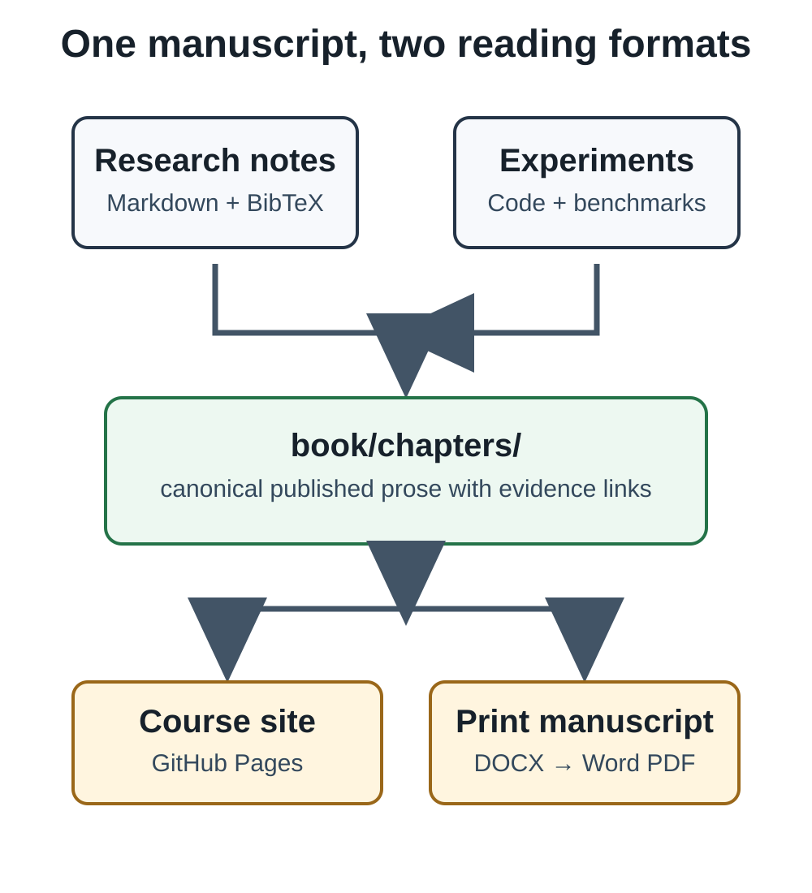

# AI From Tensors to Agents on Mac Silicon

This book is a build log for a software engineer learning modern AI on Apple
Silicon. Each chapter connects an idea to runnable code, an experiment, a
failure mode, and a decision about when the technique is worth using.

This is also a living setup chapter. It records the exact way to prepare the
project, run what is currently implemented, and distinguish a working lesson
from a planned one. We will extend it as later milestones add transformers,
local models, retrieval, and agent workflows; do not assume a command exists
until it appears here or in the chapter that introduces it.

## What you are building

The end product has one canonical editorial source and two reading formats:



- `book/chapters/` is the only source of published prose. The course does not
  copy it.
- `research/` holds working notes and the shared `references.bib` bibliography.
- `experiments/` holds small runnable lessons; `src/` contains reusable code.
- `benchmarks/` holds reproducible observations and their limitations.
- `site/` is the Docusaurus navigation shell over the canonical chapters.
- `book/build/` and PDF exports are generated artifacts and must stay out of
  Git.

The book's later capstone is a Book Intelligence Assistant. It will index this
repository's chapters, research notes, experiments, and benchmarks; retrieve
evidence with source paths; propose and critique improvements; and stop for
human approval before any write. It does not modify the project autonomously.

## What is implemented today

Chapters 1–3 have executable tensor, autograd, and PyTorch/MPS lessons with a
recorded Day 1 benchmark. Chapters 4–5 now have a deterministic synthetic
vision fixture plus matched PyTorch and TensorFlow/Keras CNN implementations.
Chapters 6–7 add controlled transformer and MLX-LM observations. Chapters 8–9
now have a provenance-preserving local retrieval baseline and learned embedding
path. Chapters 10–14 implement structured planning, persisted no-write
approval, workflow comparison, and a deterministic reliability suite. All
chapters are active manuscript drafts, not final editorial or print artifacts.
The current project status and next task are maintained in
`docs/journals/from-tensors-to-agents-beta.md`.

### A setup contract before you install anything

The commands in this chapter follow a simple contract. The base development
group is required for the shared tests. TensorFlow, Transformers, MLX,
embeddings, and agent orchestration are optional learning milestones, each in a
separate `uv` group. An optional group may download wheels, native libraries,
or model weights into caches outside Git; it therefore has a different storage
and network footprint from the source checkout.

Before any optional install, inspect the actual available filesystem with
`df -h .`. There is no universal “enough disk” number: the right headroom
depends on the package resolver, model cache, operating-system updates, and
other work on the Mac. If the reported free space safely exceeds the expected
download plus a comfortable working margin, install the group and record the
result. If not, stop before the download, record the observed constraint, and
continue with the deterministic or CPU-only portions of the book. Do not claim
that an optional experiment ran merely because its code exists.

When a command fails, diagnose from the lowest-cost boundary outward. First
check the command and working directory; then the Python version and `uv` lock;
then optional-group installation; then disk/cache state; then device/model
availability; and only then the lesson's algorithm or framework. Preserve the
first clear error and the command that produced it. Reinstalling every package
or switching frameworks before identifying the boundary makes a local setup
less reproducible, not more.

## Prerequisites

Use a Mac with Apple Silicon when you want to reproduce MPS observations, but
the early Python tests and examples are designed to fall back to CPU. Install:

- Python 3.11;
- [uv](https://docs.astral.sh/uv/) for Python environments and lockfile-based
  dependency installs;
- Node.js 20 and npm for the Docusaurus course;
- Pandoc for DOCX generation;
- Microsoft Word on macOS for the **release** PDF export. LibreOffice is only a
  non-release fallback.

Before installing a large optional framework or model package, check available
space with:

```bash
df -h .
```

Install it when there is sufficient headroom. If there is not, record the space
constraint and pause that optional milestone rather than pretending it was
completed.

## Base installation

Clone the repository, enter it, and create the locked development environment:

```bash
git clone <your-repository-url> ai-on-mac
cd ai-on-mac
uv sync --group dev
```

The first command intentionally leaves the remote URL to the reader or project
owner. The repository can be used locally without a GitHub remote.

Validate the base environment:

```bash
uv run ruff check .
uv run pytest
uv run python experiments/01-tensors/broadcasting.py
uv run python experiments/02-gradients/autograd.py
uv run python experiments/03-pytorch/train_tiny_network.py
```

The last command chooses MPS when the installed PyTorch build reports it as
available and otherwise uses CPU. An explicit device can be selected in the
benchmark command:

```bash
uv run python benchmarks/01-day1/run.py --device auto --epochs 250 --runs 5 --seed 7
```

Recorded results are machine-specific evidence, not promises of performance on
another Mac. Read `benchmarks/01-day1/README.md` before drawing conclusions.

### First-session walkthrough

On a fresh machine, make the first session intentionally small. Run the base
install, lint, tests, and the three Day 1 programs before adding a heavyweight
framework. The expected outcome is not a particular MPS speed: it is a clean
environment, numerical checks that pass, visible tensor/gradient output, and a
tiny training run that selects MPS when it is available or clearly reports CPU
fallback. This establishes that the repository, interpreter, and core package
set agree before optional caches complicate diagnosis.

Then choose one branch of the learning path. Chapters 4–5 need TensorFlow only
when you are ready to compare matched fixtures; Chapter 6 needs Transformers
for tokenizer and classifier inspection; Chapter 7 needs MLX on Apple Silicon;
Chapters 8–9 can use deterministic retrieval before learned weights; Chapters
10–14 can run their no-network fixture workflows without selecting an API
provider. Every branch has an evidence record and a fallback. Completing an
earlier branch is more useful than installing every optional group in advance.

At the end of a session, leave three artifacts: the command sequence that ran,
the relevant benchmark or test result, and a concise journal note explaining
what changed or what prevented progress. Generated caches, indexes, SQLite
checkpoints, DOCX files, and PDFs remain local/ignored; canonical prose, source
diagrams, experiment code, research notes, and benchmark descriptions belong
in Git. This division is the foundation for both reproducible lessons and a
clean future print release.

## Optional TensorFlow/Keras installation

TensorFlow is isolated in an optional `uv` group so the foundation remains
lightweight. Install and run the framework-comparison exercise only when you
reach Chapters 4–5:

```bash
df -h .
uv sync --group tensorflow
uv run --group tensorflow python experiments/04-tensorflow/train_keras_cnn.py --epochs 30
```

Run the matching PyTorch program with the same declared fixture and training
budget:

```bash
uv run python experiments/05-vision/train_pytorch_cnn.py --device auto --epochs 30
```

Compare correctness using the held-out accuracy, confusion matrix, and mistake
list in `benchmarks/02-vision/README.md`. Do not compare the two elapsed values
as framework speed: their current device and timing conditions are not a fair
benchmark.

## Optional Transformer installation

Chapter 6 uses Hugging Face Transformers with the existing PyTorch install.
The library is an opt-in group; the first run also downloads a compact
pretrained classifier into the local Hugging Face cache, outside this
repository. Check space first and then install it:

```bash
df -h .
uv sync --group transformers
uv run --group transformers python experiments/06-transformers/inspect_sentiment.py --device auto
```

The experiment selects MPS when available and falls back to CPU. It prints the
tokens, IDs, attention mask, manual logits-to-probabilities result, and the
equivalent pipeline result. The current model cache observed on the project Mac
is about 256 MiB, but model sizes vary widely; read
`benchmarks/03-transformers/README.md` before treating it as a storage estimate.

## Optional MLX and MLX-LM installation

Chapter 7 adds a local 4-bit instruction model through MLX and MLX-LM. These
packages are Apple Silicon-specific and are kept out of the base environment:

```bash
df -h .
uv sync --group mlx
uv run --group mlx python experiments/07-mlx/run_local_model.py
```

The initial model download is approximately 276 MiB in the local Hugging Face
cache. The script prints the exact model, declared 4-bit quantization, prompt,
token counts, a warm-up, timing boundary, generation rate, and partial memory
observations. It does not compare runtimes or rate answer quality; see
`benchmarks/04-mlx/README.md` for the interpretation rules.

## Optional learned-embedding installation

Chapters 8–9 add semantic search and evidence-only RAG over this repository.
The small deterministic baseline remains available for tests and offline
inspection; the learned path uses a compact Sentence Transformers encoder. Its
first use downloads public model weights into the local Hugging Face cache, not
the repository:

```bash
df -h .
uv sync --group embeddings
uv run --group embeddings python experiments/08-embeddings/book_search.py \
  --query 'Where do we record benchmark timing limitations?'
uv run --group embeddings python experiments/09-rag/grounded_answer.py \
  --query 'What should an experiment record?'
uv run --group embeddings python evals/run_book_intelligence.py
```

Use `--deterministic` with either program to exercise the lightweight baseline
without loading the optional model. The RAG demonstration returns retrieved
excerpts, source paths, and citation keys where available. It refuses a query
when retrieval is empty or below its conservative threshold; it does not claim
to produce a complete natural-language answer. Read
`benchmarks/05-book-intelligence/README.md` for the recorded environment and
limitations.

## Optional structured-system installation

Chapter 10 compares the direct OpenAI-compatible SDK path with LangChain over
the same retrieved evidence. The installed package group does not call an API
or require a key; its default example is a no-network fixture comparison:

```bash
df -h .
uv sync --group agents
uv run --group agents python experiments/10-systems/compare_structured_planning.py
uv run --group agents python experiments/11-langgraph/approval_workflow.py
```

An intentionally separate `--api` mode requires all three process environment
variables: `BOOK_INTELLIGENCE_API_KEY`, `BOOK_INTELLIGENCE_API_BASE`, and
`BOOK_INTELLIGENCE_MODEL`. Never place their values in project files. A missing
value fails before a request is made. See
`benchmarks/06-structured-systems/README.md` for the narrowly recorded adapter
comparison and its limits.

## Site and manuscript builds

Build the course site with its own Node lockfile:

```bash
cd site
npm ci
npm run build
cd ..
```

Build the draft manuscript DOCX from the committed Lulu 6×9 Word template:

```bash
./scripts/build-book.sh
```

The course site can render the editable SVG diagrams directly. Pandoc needs an
SVG rasterizer such as `rsvg-convert` available on `PATH` to embed those same
figures in DOCX; otherwise it warns and omits the image. Install that print
dependency before treating a DOCX proof as visually complete, then rebuild and
inspect the generated pages. Keep the SVG source under `book/assets/`; any PNG
fallback should be generated from that source at print resolution, not edited
independently.

On macOS with Homebrew, install and verify that dependency with:

```bash
brew install librsvg
rsvg-convert --version
```

This writes `book/build/from-tensors-to-agents.docx`. It is a review artifact,
not an upload-ready PDF. At print-production time, export it through Word on
macOS, run the preflight script, and inspect every rendered page before calling
the result release-ready.

## Optional ClineFlow journaling

Use [ClineFlow](https://github.com/hassanvfx/clineflow) when persistent journals
and project context would make AI-assisted development easier to resume. It is
an optional workflow aid: this companion repository neither installs nor
depends on it at runtime.

To adopt the same journal workflow, follow ClineFlow's current README in the
repository root and then create a project journal under `docs/journals/`. For
this project the long-lived journal is
`docs/journals/from-tensors-to-agents-beta.md`. Begin each work session by
reading its current status; before each commit, record the decision, changed
paths, commands and results, failures, and next smallest action.

## How to learn with the repository

For every implemented chapter:

1. Read the intuition and predict the result.
2. Run the listed program unchanged.
3. Change one declared condition—shape, seed, device, or data difficulty.
4. Keep the original observation; record the new condition and result
   separately.
5. Read the associated benchmark or research note before making a general
   claim.

The course site and print book share this Markdown source. Complete code and
measured observations stay in the companion repository so the prose can remain
readable without hiding the evidence.
