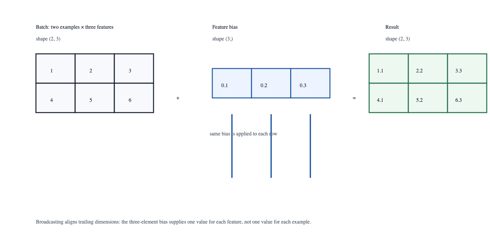

# Everything Is a Tensor

## Intuition

A tensor is a collection of numbers with a shape. The numbers carry values;
the shape says how to interpret them. A scalar has shape `()`, a list of three
measurements has shape `(3,)`, a two-row table has shape `(2, 3)`, and a batch
of color images commonly has four axes: `(batch, height, width, channels)` or
`(batch, channels, height, width)`. The central habit of machine learning is
to ask what every axis means before asking which model to use.

This is more than vocabulary. Linear algebra lets one operation describe many
examples at once, and tensor libraries make that operation executable on CPUs
and accelerators. The representation is therefore the bridge between a
mathematical expression and a training program [@goodfellow2016deep].

The word *tensor* is not an instruction to force every object into a rectangle.
It is a contract for the numerical part of a computation. Text, images, and
documents begin in forms that humans can inspect; preprocessing selects
properties and assigns them a numerical layout. That layout tells later code
what operations are meaningful. Six values can form either two examples with
three features or three examples with two features. The values are identical,
but the program’s question has changed.



## Problem

Suppose two examples each have three features and we want to add a different
offset to each feature. We want one vector of offsets to apply to every row,
not a manual loop that can quietly confuse examples with features. The desired
calculation is:

```text
(2, 3) batch + (3,) bias → (2, 3) result
```

The second operand is *broadcast* across the leading batch axis. Broadcasting
is concise, but it is also a common source of silent mistakes: `(3,)` means
something very different from `(3, 1)`.

PyTorch aligns dimensions from the right. They must match, one must be size
one, or an absent leading dimension is treated as size one. That is why
`(2, 3) + (3,)` works: features match and the bias expands across examples.
`(2, 3) + (2,)` fails because the rightmost dimensions are three and two.
This rule is useful, but it cannot know what an axis means. A valid broadcast
over the wrong axis is often more dangerous than an exception because it leaves
plausible numbers behind.

Keep batching and broadcasting separate. Batching gives one operation many
independent examples. Broadcasting reuses a value along an axis. A learned bias
is reused for every example; labels usually are not. This distinction reappears
in losses, attention masks, image normalization, and embedding batches.

## Minimal implementation

Run the complete example:

```bash
uv run python experiments/01-tensors/broadcasting.py
```

The program adds `[0.1, 0.2, 0.3]` to each row of a `(2, 3)` tensor. Predict
the result before running it. The expected first row is `[1.1, 2.2, 3.3]`; if
you instead expected each number in the first column to change by `0.1`, you
have correctly identified the feature axis.

The point of the exercise is not the arithmetic. It is the prediction. Make a
small shape table before you run a tensor expression:

| Name | Shape | Meaning |
| --- | --- | --- |
| `examples` | `(2, 3)` | two observations, three features each |
| `bias` | `(3,)` | one offset for each feature |
| `shifted` | `(2, 3)` | the same two observations after the offset |

This habit scales. For an image classifier, `(32, 3, 224, 224)` is not just a
four-dimensional box: it means 32 images, RGB channels, and two spatial axes.
For a language model, `(batch, tokens, hidden)` separates independent sequences
from positions within a sequence and from the values used to represent each
position. A model may accept an array with the right number of values and still
produce nonsense if those axes have been exchanged.

Two operations that look similar have different meanings. `reshape` changes
how a contiguous sequence of values is grouped; `transpose` or `permute`
changes the order in which axes are interpreted. Neither operation discovers
the intended meaning for us. Use a reshape when the grouping is known to be
safe, such as turning a `(batch, channels, height, width)` image batch into a
`(batch, features)` table immediately before a fully connected layer. Use a
permutation when an API expects the same axes in another order. In both cases,
write the before-and-after shapes and inspect a deliberately tiny example.

## A more realistic implementation

Neural-network batches use the same idea at larger scale. A linear layer maps
an input batch `X` with shape `(batch, input_features)` to an output with
shape `(batch, output_features)`:

```text
X @ Wᵀ + b
```

Here `b` has shape `(output_features,)` and broadcasts once per example. The
operation preserves the batch axis, replaces the feature axis, and gives one
output vector per input. Writing those shapes beside the expression prevents
many errors before Python runs.

There are three contracts to check at a layer boundary:

1. The final input axis must equal the layer's `input_features`.
2. Every leading axis represents independent items that should survive the
   operation unchanged.
3. The bias and any normalization parameters must align with the output
   feature axis, not accidentally with a batch or spatial axis.

For example, an input `X` of shape `(4, 2, 3)` can represent four documents
with two tokens and three features per token. A linear layer with three input
features can operate on it directly and returns `(4, 2, output_features)`.
It does not need a Python loop: PyTorch treats the leading axes as a collection
of positions. That convenience is powerful, but only if the programmer has
already decided that the two-token axis should be preserved.

The companion experiment is intentionally small enough to modify and rerun in
seconds: [broadcasting.py](../../experiments/01-tensors/broadcasting.py).
Later examples use the same contracts for a batch of training examples,
per-example losses, and model parameters. If a later chapter seems mysterious,
return to the layer boundary and annotate its axes first.

## Experiment

Change the bias in `experiments/01-tensors/broadcasting.py` from `(3,)` to
`(2, 1)`. First predict the new result. Then deliberately try an incompatible
shape such as `(2,)` and read PyTorch’s error message. Record which axes you
thought were aligned and which axes PyTorch attempted to align.

Extend the exercise with a second batch containing one example. Concatenate it
with the original batch along axis zero, then verify that the bias still has
shape `(3,)`. This separates two ideas that beginners often conflate: changing
the number of examples changes the batch axis, whereas changing the number of
measurements per example changes the feature axis. A model that was trained
for three features cannot silently accept four just because its batch size is
allowed to vary.

For an observation worth keeping, record the command, PyTorch version, device,
input shapes, expected output, and actual output. This first record establishes
the format used by the repository's later benchmarks: an observation is more
useful when another reader can reproduce the exact question it answers.

## What broke

The most useful early failure is a shape mismatch. Do not immediately reshape
until the error disappears. State the intended meaning of each axis and verify
that the reshape preserves it. A technically valid reshape can still be a
conceptual bug—for example, mixing examples across a batch or treating image
width as channels.

Other common failures are subtler. Calling `squeeze()` without an axis can
remove the batch dimension when a final batch contains a single example. Using
integer tensors where a differentiable floating-point calculation is expected
can prevent a gradient from being created. Moving model weights to an
accelerator while leaving inputs on the CPU produces a device mismatch. The
remedy is not a list of magic reshapes; it is an invariant: at each important
boundary, assert the dtype, device, rank, and named axis sizes you expect.

When debugging, shrink the problem before adding print statements everywhere.
Use two examples and two or three features, print shapes rather than full large
tensors, and compare one result with a hand calculation. Once the small case is
understood, restore the real data. This discipline also makes tests clearer:
a numerical test can show the expected values while a shape test protects the
meaning of the operation.

## Alternatives and when to use them

Python lists work for tiny demonstrations, and NumPy uses the same broad
array-and-broadcasting model. Use PyTorch tensors when the next step needs
automatic differentiation, neural-network modules, or accelerator placement.
Avoid a tensor library abstraction only when the data is truly irregular and a
named record or graph structure communicates the domain better.

Named tensor tools, type annotations, and runtime shape-checking libraries can
make the contracts more explicit. They are helpful in a large codebase, but
they do not replace the underlying reasoning and can make a first experiment
harder to read. Plain PyTorch shape comments are a good default for this book:
they are visible beside the operation, work on every supported machine, and
make the transition to another framework straightforward. TensorFlow, JAX, and
NumPy all use closely related array semantics even though their module APIs
differ.

Do not use broadcasting merely to avoid a line of code. An explicit reshape,
such as `bias[None, :]`, can be preferable when it documents the axis that is
being expanded. Conversely, avoid repeating a bias to the full batch shape
only to make the addition look explicit: it consumes memory and obscures the
fact that the values are shared. Prefer the representation that makes the
mathematical intention easiest for a future reader to verify.

## Takeaway

Tensors are not merely containers. Their shapes are part of the program’s
meaning. Before changing an operation, name every axis, write the input and
output shapes, and decide exactly which axes may broadcast.
