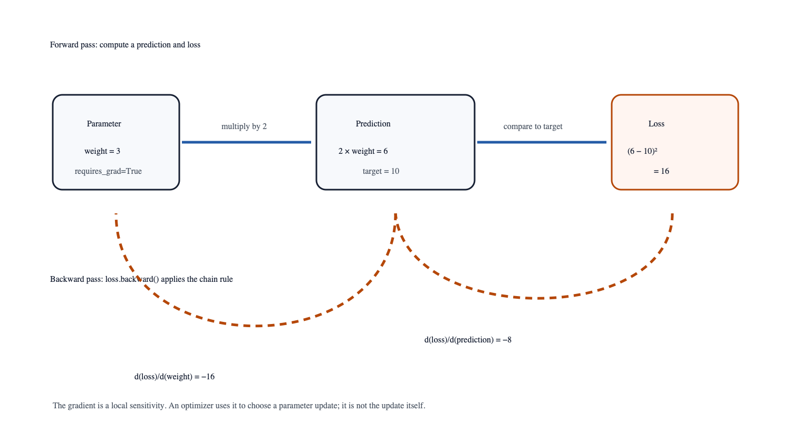

# Learning Is Error Correction

## Intuition

Learning begins with a disagreement: a model makes a prediction, a target says
what should have happened, and a loss function turns their difference into one
number. A gradient then answers a local question: if a parameter moves a tiny
amount, how does that loss change? It is not a learning rule by itself. It is
the measurement used by an optimizer to choose a corrective step
[@goodfellow2016deep].

The useful mental model is a repeated correction cycle, not a machine that
"understands" after one update. A model has adjustable parameters, a dataset
supplies examples and targets, and a loss compresses the model's disagreement
with those targets into a number the training process can minimize. Each step
uses only local information: the gradient tells us which nearby changes would
raise or lower the current loss. It does not prove that the next step improves
unseen data, finds the global best solution, or produces a useful model. Those
questions require a held-out evaluation and a careful experiment.

This distinction matters because loss can be small for the wrong reason. A
model might memorize a tiny training set, exploit a data leak, or optimize an
objective that fails to represent the real task. Gradient descent is extremely
effective at following a stated objective; it cannot decide whether that
objective was the right one. Treat a training loss as evidence about the
training calculation, not as a general claim about quality.

## Problem

Take the one-parameter model `prediction = 2 × weight`, target `10`, and
squared error loss `(prediction - target)²`. With `weight = 3`, the prediction
is `6`, the loss is `16`, and the analytic derivative is:

```text
d/d(weight) (2 × weight - 10)² = 4 × (2 × weight - 10) = -16
```

The negative value means that a small increase in this particular weight
reduces the loss locally. The goal is to verify that PyTorch’s autograd system
constructs the same derivative from ordinary tensor operations.



## Minimal implementation

```bash
uv run python experiments/02-gradients/autograd.py
```

The expected output is a prediction of `6.0`, a loss of `16.0`, and
`d(loss)/d(weight)=-16.0`. The automated test independently verifies that
analytic result in `tests/test_day1.py`.

## A more realistic implementation

Real models contain many parameters and nested functions. Rather than writing
one derivative per parameter, PyTorch records the operations used to produce a
loss. Calling `loss.backward()` applies the chain rule through that recorded
computation. An optimizer then reads each parameter’s `.grad` value and
updates it. The common training-loop order is:

```text
zero old gradients → forward pass → loss → backward pass → optimizer step
```

The order matters. Gradients accumulate by default because accumulation is
useful for some workloads. In ordinary minibatch training, failing to clear
them combines the current gradient with stale work from previous steps.

For a scalar parameter `w`, a basic gradient-descent update is:

```text
w ← w - learning_rate × d(loss)/d(w)
```

In the example, the derivative is `-16`. With a learning rate of `0.1`, the
new weight is `3 - 0.1 × (-16) = 4.6`: the parameter moves upward because an
upward movement reduces this loss nearby. The sign is the important part. The
optimizer subtracts the gradient because the gradient points toward increasing
loss. A learning rate decides how far to walk in the opposite direction.

Learning rate is a trade-off, not a universal constant. If it is too small,
training makes little visible progress. If it is too large, the update can
overshoot a useful region and make the loss oscillate or diverge. The right
value depends on input scaling, architecture, loss, optimizer, batch size, and
the data itself. Start with a documented baseline and examine the loss curve
rather than interpreting a single final number.

The repository's tiny regressor makes this cycle concrete. It trains a
deliberately small network using mean squared error and SGD; its recorded Day
1 observation is available in the companion repository's
`benchmarks/01-day1/README.md` record.
That record reports a particular workload and machine configuration. It is not
a promise that every MPS or CPU workload will have the same timing or memory
behavior.

### A worked minibatch view

Most training code evaluates several examples at once. If a batch contains
predictions `p₁, …, pₙ` and targets `y₁, …, yₙ`, mean squared error is often
written as:

```text
loss = (1 / n) × Σᵢ (pᵢ - yᵢ)²
```

The reduction to one scalar is important. Reverse-mode autograd efficiently
computes derivatives of one scalar loss with respect to many parameters. The
mean also makes the scale of the loss less sensitive to batch size than a raw
sum, although changing batch size still changes the noise and frequency of
updates. Classification chapters use cross-entropy instead of squared error,
but the forward → loss → backward → update rhythm remains the same.

In PyTorch, tensors produced by operations remember enough of their history to
differentiate when needed. Leaf tensors such as a learnable weight receive a
`.grad` after `backward()`. Intermediate predictions usually do not need to
store a user-visible gradient. This is why a training loop reads gradients from
model parameters, not from every temporary result. It is also why retaining
large computation graphs accidentally can consume significant memory.

## Experiment

Change the starting weight and target in the autograd script. Calculate the
derivative on paper before execution, then compare it with `weight.grad`.
Next, call `backward()` twice without clearing the gradient and observe the
accumulation. Finally, reset the gradient and explain why the normal training
loop performs that reset before every forward pass.

Then turn the single calculation into five manual updates. After each update,
write down weight, prediction, loss, and gradient. You should see the loss
fall for a sensible learning rate, while the size of the gradient typically
shrinks near a local minimum. Repeat with a much larger learning rate. If the
loss rises or jumps between values, do not call the model broken: you have
observed an optimizer configuration that takes steps too large for this local
surface.

Finally, compare autograd with a finite-difference estimate. For a small
positive `ε`, approximate the derivative by:

```text
(loss(weight + ε) - loss(weight - ε)) / (2 × ε)
```

It should be close to `weight.grad` for a carefully chosen epsilon. It will
not be exactly equal because floating-point arithmetic and the approximation
both introduce error. This comparison is valuable when implementing a custom
operation: finite differences are slow, but they can reveal whether a gradient
is wildly wrong before a large training run hides the source of the problem.

## What broke

Two beginner errors reveal important boundaries. A tensor without
`requires_grad=True` does not request a derivative with respect to itself.
And calling `backward()` after discarding or mutating a computation graph can
produce an error because autograd needs the original operations. The repair is
not to memorize error messages; it is to identify which values are parameters,
which values are observations, and which loss produced the gradient.

Another failure is reading a gradient after the optimizer has already updated
the parameter and assuming it describes the new model. A gradient belongs to a
specific forward pass and parameter value. Record the loss and gradient before
the update when debugging. Similarly, in-place mutation of a value autograd
needs can invalidate its saved history. Prefer ordinary expressions first;
introduce in-place operations only when profiling shows a real need and tests
protect the computation.

Numerical scale can also fail quietly. Extremely large activations or a poorly
chosen exponential can create `inf` or `nan`, which then flows through the
loss and gradients. Add checks for finite loss values in experiments, inspect
input ranges, and reduce the problem to the first batch that fails. Gradient
clipping, normalization, and more stable loss implementations are tools for
particular problems, not substitutes for identifying where the invalid value
first appeared.

## Alternatives and when to use them

For a one-variable function, symbolic or hand differentiation is clearer and
often safer. Finite differences are useful as a slow diagnostic check. Use
reverse-mode automatic differentiation when one scalar loss depends on many
parameters—the standard setting for neural-network training.

Forward-mode automatic differentiation can be attractive when there are few
parameters and many outputs, which is the opposite shape of most neural-network
training. Optimization methods also differ: SGD is transparent and provides a
useful baseline; momentum smooths updates; adaptive methods such as Adam adjust
per-parameter step scales. No optimizer removes the need for a validation
metric and an explicit stopping rule. Use the simplest optimizer that makes the
experiment readable, then compare alternatives under the same data split,
seed, and measurement method.

## Evidence trail

The gradient source note is `research/01-tensors/notes.md`; the runnable scalar
example is `experiments/02-gradients/autograd.py`, with deterministic checks in
`tests/test_day1.py` and the Day 1 record in `benchmarks/01-day1/README.md`.

## Takeaway

Loss measures error, gradients measure local sensitivity, and an optimizer
chooses the update. Keeping those roles separate makes backpropagation
understandable rather than magical.
