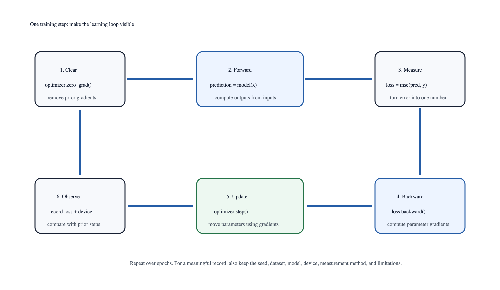

# Building a Neural Network with PyTorch

## Intuition

A neural network becomes useful only when its parameters participate in a
repeatable cycle: make a prediction, measure error, compute gradients, and
update the parameters. PyTorch exposes that cycle directly. That visibility is
valuable at the start because it lets us connect the tensor shapes from Chapter
1 and gradients from Chapter 2 to an actual learning system.

There are two complementary ways to read a PyTorch program. At the mathematical
level, a network is a function with parameters: inputs go in, predictions come
out, and training adjusts the parameters to reduce a loss. At the program
level, `nn.Module` groups those parameters and its `forward` method describes
the calculation. The optimizer does not know the meaning of a layer; it simply
receives the module's registered parameters and updates their gradients after
the backward pass. Keeping those roles separate makes it easier to replace one
part without losing the training contract.

The goal of this chapter is not to claim that a tiny network resembles a
production model. It is to make every moving part visible under conditions that
can be repeated. A small synthetic task lets us inspect shapes, loss values,
device selection, and seed behavior without a download, a lengthy run, or a
dataset whose quirks dominate the lesson.



## Problem

Build the smallest network that can learn a known relationship without hiding
the training loop behind a high-level trainer. The fixed task is 64 synthetic
pairs generated from `target = 2 × input + 0.5`. The model is:

```text
Linear(1, 8) → Tanh → Linear(8, 1)
```

This network has more capacity than the linear target requires. That is
intentional: it demonstrates the standard PyTorch components while retaining a
small, deterministic workload whose behavior is easy to inspect.

The input tensor has shape `(64, 1)`: 64 independent examples and one scalar
feature per example. Targets have the same shape. The first linear layer turns
each one-feature example into eight hidden values, `Tanh` applies the same
nonlinearity to each hidden value, and the final layer maps eight hidden values
back to one prediction. The batch axis is preserved at every stage:

```text
(64, 1) → Linear(1, 8) → (64, 8) → Tanh → (64, 8) → Linear(8, 1) → (64, 1)
```

This is deliberately more flexible than necessary. A single linear layer could
represent the target relationship exactly. The hidden layer introduces the
composition used by larger networks while the known target makes it possible to
notice an implausible result quickly. If this model cannot reduce mean squared
error, the first suspects are the data shape, seed, update order, learning
rate, or device—not the difficulty of the task.

The task gives us a useful sanity check. Because the target is known,
`2 × input + 0.5`, a model prediction can be compared with both the training
loss and the underlying relationship. The hidden layer is intentionally
overcomplete for this job: it can represent the mapping, but also makes the
parameter path less obvious than a single slope and intercept. That makes it a
good bridge from Chapter 2's scalar gradient to a module with many weights.

Count the contracts before running code. The dataset fixes input/target shapes
and deterministic construction. The module fixes input width, hidden width,
activation, and output width. Mean squared error fixes the objective. SGD fixes
how gradients become updates. Device choice fixes where compatible tensors
execute. If loss fails to fall, change and record one contract at a time rather
than changing model width, learning rate, seed, and device together.

## Minimal implementation

Run the complete training example:

```bash
uv run python experiments/03-pytorch/train_tiny_network.py
```

The script selects Apple MPS when the installed PyTorch build reports it as
available; otherwise it falls back safely to CPU. It fixes the random seed to
`7`, trains for 250 epochs with SGD and mean squared error, and prints the
first and final losses.

Read the script beside its shared training function before running it. The
entry point chooses a device, but the function responsible for training receives
that device explicitly. It then fixes the PyTorch seed, moves both inputs and
targets to the selected device, creates the model on that device, and repeats
the training loop. Passing the device rather than relying on a global default
keeps the CPU and MPS paths comparable: the calculation is identical apart from
where compatible operations execute.

The loop contains a few details that are easy to overlook:

1. `model.train()` is implicit for this tiny model because it has no dropout or
   batch-normalization layers, but real training scripts should set their mode
   deliberately.
2. `optimizer.zero_grad()` happens before `backward()` because PyTorch adds new
   gradients to existing `.grad` tensors by default.
3. `loss.detach().cpu().item()` records a plain Python number. Detaching avoids
   retaining every epoch's computation graph; moving to CPU allows a scalar to
   be read consistently when the model is on MPS.
4. The loop stores a loss for inspection, but it does not use that training
   loss to decide that the model is ready for an unseen dataset.

Those choices generalize. The later CNN and transformer examples add data
loaders, validation metrics, and more complex modules, but the core feedback
cycle remains explicit.

### Parameters are data owned by the module

`nn.Module` is more than a convenient container. When a layer is assigned as an
attribute, PyTorch registers its learnable tensors so `model.parameters()` can
hand them to the optimizer. A plain tensor created inside `forward` is not a
durable parameter merely because it participates in arithmetic. Create intended
parameters in `__init__`, use them in `forward`, and verify their shapes before
training.

The optimizer stores state about the parameters it received. In this SGD
example, that state is minimal; an optimizer such as Adam also keeps moving
averages. Replacing a model parameter after constructing an optimizer can leave
the optimizer updating the old tensor. Keep model construction, optimizer
construction, and the training loop in visible order.

### Loss curves are debugging traces, not release criteria

The loss list is a trace of one optimization run. A falling curve tells us that
this model is reducing this objective on these examples. It does not certify
generalization, calibration, or stability outside the observed interval. A flat
initial curve can suggest an update-order mistake, zero/invalid gradients,
unsuitable learning rate, or a device/data mismatch. A falling curve followed
by a rise can suggest overshooting. Print a few checkpoints before relying only
on the last number.

## Real implementation: make the observation reproducible

The benchmark runner makes device selection, warmup, synchronization, number
of timed runs, and seed explicit:

```bash
uv run python benchmarks/01-day1/run.py --device auto --epochs 250 --runs 5 --seed 7
```

On the recorded M4 Pro environment (macOS 26.1, Python 3.11.9, PyTorch 2.13.0),
MPS was available. Five timed runs reached the same final loss, `0.000994`,
from an initial loss of `1.892602`; their median wall time was 120.537 ms.
The complete workload, individual values, and limitations are recorded at
`benchmarks/01-day1/README.md` in the companion repository.

This is evidence about one tiny synthetic workload on one machine. It is not a
claim that MPS is faster than CPU, nor a prediction about larger networks.

Reproducibility has layers. Fixing a seed makes this compact workload repeat on
the recorded environment, but it does not make every accelerator operation,
library version, or data-loader configuration deterministic. Record the
environment instead of promising absolute repeatability: operating system,
Python and PyTorch versions, selected device, model, dataset construction,
optimizer, epoch count, warmup procedure, and timing method all affect what a
benchmark means. A useful benchmark answers one narrow question well.

Device selection deserves the same discipline. MPS is Apple's Metal backend
for PyTorch-compatible operations, but availability is not enough to prove that
every operation in a future model is supported or optimal there. The helper
returns CPU when MPS is not available, so the educational program remains
runnable on other machines. An explicit MPS request, by contrast, should fail
when unavailable; silently changing a requested benchmark device would make a
comparison ambiguous.

## Experiment

Run the benchmark once with `--device cpu` and, on an MPS-capable Mac, once
with `--device mps`. Do not compare only the median number: first confirm the
same seed, epochs, versions, warmup procedure, and final loss. Then increase
the epoch count and observe whether setup time becomes a smaller fraction of
the measurement. Record every changed condition rather than overwriting the
existing observation.

Before comparing devices, use the same code path and verify the result rather
than only the elapsed time. The final loss should be compatible with the fixed
workload, and the selected device should appear in the printed output. Then
separate setup from steady-state work: first model creation, allocator setup,
and compilation-like initialization can dominate a microbenchmark. The runner
uses one unmeasured warmup and measures multiple timed runs to make that choice
visible. It still does not report a CPU comparison result until one is actually
run and committed.

Try one controlled failure as well. Request `--device mps` on a CPU-only
machine, or temporarily request an unavailable backend in a unit test. The
right outcome is a clear error that tells the reader what was requested and how
to use the safe fallback. A benchmark that quietly changes the requested
condition produces a polished but misleading number.

The benchmark's five timed values deserve the same care as a loss trace. The
median summarizes five repeats after one unmeasured warm-up; it does not reveal
cold-start experience, distribution tails, energy use, or memory use. If a
future question concerns first-use latency, measure model creation and the
first training call separately. If it concerns steady state, retain the warm-up
and show variation. Do not edit the existing record to make a later measurement
look comparable—create a new record with its own workload and date.

MPS synchronization is a measurement boundary rather than a performance trick.
Device work can be queued; a host timer that stops before the queue completes
reports Python dispatch time rather than complete model work. Synchronizing
before and after the timed section answers a clearer wall-clock question for
this runner. Other asynchronous pipelines need their own declared boundaries.

### Worked case: one tiny run, three different questions

Run the teaching script with its fixed seed, 250 epochs, SGD learning rate
0.08, and automatic device selection. On the recorded M4 Pro observation,
the first loss was 1.892602 and the last was 0.000994. That answers the first
question: under this declared synthetic dataset and model, the explicit loop
reduced its training mean-squared error. It does not answer whether the model
would generalize, because the exercise deliberately has no held-out dataset.

The second question is reproducibility. The benchmark repeats the same
workload five times after an unmeasured warmup. Each recorded MPS run reaches
the same final loss, 0.000994. That provides evidence for deterministic
behavior of this narrow seed/environment/workload combination. It does not
mean every PyTorch program is deterministic on every accelerator, nor that an
edited model with dropout, shuffled data, or different versions will reproduce
the number automatically.

The third question is timing. The five recorded wall-clock values range from
119.637 to 122.571 ms, with a median of 120.537 ms after MPS synchronization.
The timer includes the declared training workload and excludes the unmeasured
warmup; it is not a CPU comparison, first-use latency result, memory measure,
or proxy for a larger network. The three questions need three sentences in a
benchmark record because “the model trained in 120 ms” would collapse
convergence, repeatability, and timing into one misleading claim.

To debug a run that does not follow this pattern, inspect contracts in order.
Confirm that inputs and targets retain shape `(64, 1)`, that the model and both
tensors share the selected device, that `zero_grad` precedes `backward`, and
that the seed is set before model construction. Then lower the learning rate
or shrink the program to one batch. Do not first add layers or rerun until a
favorable final loss appears; a reproducible failure is the evidence needed to
locate the broken training boundary.

## What broke

Accelerator availability is conditional. The example must run on CPU-only
machines, and an explicit `--device mps` request fails clearly if MPS is
unavailable. Also, accelerator work may be queued: timing without an MPS
synchronization can stop the clock before all device work finishes. The
benchmark runner synchronizes before and after each timed run for that reason.

The most common model failure is a device split: model parameters live on MPS
while inputs or targets remain on CPU. The resulting error is useful because it
identifies the boundary. Move the complete batch—inputs, targets, and any
attention masks or auxiliary tensors—to the same selected device as the model.
Do not solve it by scattering `.to("mps")` calls throughout a network; choose a
device once, pass it inward, and make the transfer visible at the data boundary.

Another tempting mistake is to measure an improving training loss and call the
network accurate. This synthetic exercise has no held-out split because its
purpose is to test the feedback loop, not generalization. In a real task, keep
validation and test examples separate from parameter updates. Later vision
chapters will use that separation for metrics and error inspection.

Overfitting is deliberately invisible here because no unseen-distribution claim
is being made. The vision experiment adds validation and test partitions because
its question changes from “does the loop reduce a known loss?” to “does this
classifier solve a held-out fixture?” Reusing training loss as a quality score
across those questions would blur the distinction this regressor teaches.

## Alternatives and when to use them

For a first prototype, an explicit loop is the best choice because every step
is inspectable. Higher-level PyTorch training frameworks can reduce repetition
after the fundamentals are understood. For a strictly linear relationship, a
single `Linear(1, 1)` model is simpler; the small hidden layer here exists to
teach composition, not because the data demands it.

NumPy plus hand-written gradients is a reasonable way to learn the mechanics,
but it becomes fragile as a model gains branches and many parameters. TensorFlow
and JAX provide other automatic-differentiation ecosystems; Chapter 4 compares
an equivalent vision task rather than treating API syntax as a framework
benchmark. Within PyTorch, a high-level trainer can manage checkpoints, mixed
precision, and distributed execution after an explicit baseline has established
the data, loss, metric, and failure behavior. Abstraction should remove
repetition, not conceal the evidence needed to trust an experiment.

Mixed precision, gradient accumulation, schedulers, checkpoints, and data
loaders are valuable later additions, but each adds a contract. Mixed precision
changes numeric formats and loss scaling; accumulation changes the effective
batch/update schedule; checkpoints add versioning and restoration questions.
Introduce them only when the baseline's data, model, loss, metric, and device
boundaries already have tests. A small explicit loop remains the reference
implementation against which automated training can be checked.

## Evidence trail

Read `research/01-tensors/notes.md`, run
`experiments/03-pytorch/train_tiny_network.py`, and interpret timing only
through `benchmarks/01-day1/README.md` and its declared workload.

## Takeaway

PyTorch training is a controlled feedback loop. A useful result is not merely a
lower loss: it is a lower loss tied to a known seed, dataset, model, device,
measurement method, and record of what the result does *not* prove.
