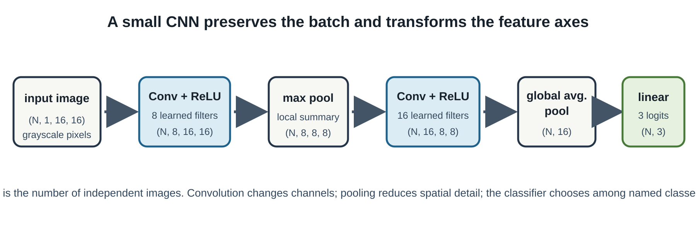

# How Neural Networks Learn to See

## Intuition

Convolutions use local structure and repeated filters to turn pixels into useful
features. A filter that responds to a short vertical stroke can be useful at
many image positions, so a convolution shares the same learned weights across
the image. Pooling and later layers combine local responses into a decision
about the whole image [@goodfellow2016deep].

The important idea is *inductive bias*: a convolution assumes that nearby
pixels matter together and that a useful local pattern may appear in more than
one position. A fully connected layer can in principle learn such patterns,
but it assigns a separate weight to every input connection. A convolution uses
one small kernel repeatedly, which reduces parameters and expresses the useful
prior that a vertical edge is still a vertical edge when it shifts a few pixels.



## Problem

Train and inspect a small image classifier rather than treating a CNN as a black
box. We need more than a final accuracy: the split must be held out, the output
classes must be named, and errors must be inspectable.

## Minimal implementation

The companion fixture creates three balanced classes of 16×16 grayscale
images: a vertical, horizontal, or diagonal noisy stroke. It is generated from
fixed seeds and stored as code, so a reader does not depend on an external
download or an unstable train/test split.

Run the complete PyTorch implementation:

```bash
uv run python experiments/05-vision/train_pytorch_cnn.py --device auto --epochs 30
```

The model is deliberately small:

```text
image → Conv(8) → ReLU → max pool → Conv(16) → ReLU → global average pool → 3 logits
```

Logits are unnormalized class scores. Cross-entropy compares them to the known
class index, and Adam changes the filters to reduce that loss.

The actual tensor path is worth writing down. The fixture produces a
channels-first batch `(N, 1, 16, 16)`. The first padded 3×3 convolution keeps
the 16×16 spatial grid while changing one input channel into eight learned
feature maps. Max pooling halves height and width to `(N, 8, 8, 8)`. The next
convolution creates 16 feature maps, and adaptive global-average pooling turns
each entire map into one number. Flattening produces `(N, 16)`, then the final
linear layer emits `(N, 3)` logits—one score for each named class.

Pooling does not discover an object; it discards some exact location detail in
exchange for a compact local summary. On this fixture, that is a reasonable
choice because a stroke may be offset slightly. On a task where exact position
is the answer, aggressive pooling can remove the signal we need. Architecture
is therefore a hypothesis about the task, not a collection of default layers.

## Real implementation: an inspection-friendly evaluation

`src/from_tensors_to_agents/vision.py` owns the fixture, model, class names,
and confusion-matrix function. The training script reports train, validation,
and test accuracy separately; it also prints the confusion matrix with actual
classes in rows and predicted classes in columns, followed by every held-out
mistake. This output is intentionally simple enough to test in CPU CI.

## Experiment

The recorded PyTorch MPS run used 32 training examples per class, 16 validation
examples per class, 16 held-out test examples per class, seed `17`, Adam at
`0.01`, and 30 epochs. It reached 1.000 accuracy on each split. Its held-out
matrix was the identity matrix: each of the 16 vertical, 16 horizontal, and 16
diagonal test examples was classified correctly. The explicit CPU run produced
the same accuracy and zero mistakes. See `benchmarks/02-vision/README.md` for
the complete record and timing limitations.

Zero mistakes are still an error-analysis result: there were no misclassified
examples to inspect under this controlled distribution. They do *not* mean the
network can see in the everyday sense. The images are highly separable, the
same generator supplies every split, and the test set is small. A next
experiment should make the boundary less clean—for example by varying stroke
position, contrast, or noise—and report which classes then confuse one another
before considering a real image dataset.

## What broke

The easy failure is to report training accuracy alone. A model can memorize a
tiny fixture while performing poorly on unseen data, so this experiment keeps
validation and test partitions separate. Another easy failure is a layout
mismatch: PyTorch convolution expects channels-first inputs while Keras uses a
channels-last version of the same fixture. The matched framework experiment
converts that layout explicitly rather than relying on an implicit transpose.

Finally, do not call this a general CNN benchmark. Its purpose is to make the
flow from pixels to logits inspectable and deterministic; it does not measure
augmentation, robustness, scale, or real-world generalization.

## Alternatives and when to use them

For image-like grids with local patterns, convolution gives a useful inductive
bias and often needs less data than a fully connected network. A small linear
classifier is a worthwhile baseline when the relationship may be simple. For
large-scale vision work, residual CNNs and vision transformers are common
alternatives, but they add capacity and evaluation requirements that would hide
this chapter's basic lesson.

## Takeaway

Neural networks learn to see by turning repeated local measurements into a
loss-driven decision. Trust the result only as far as its held-out data,
confusion matrix, error list, and stated limitations allow.
