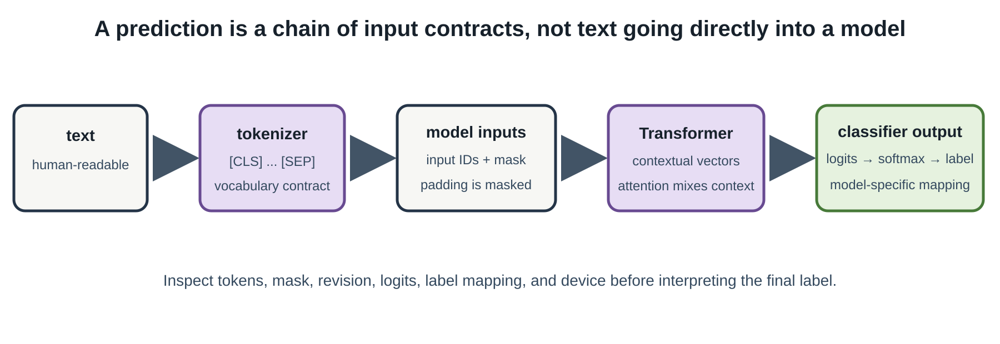

# The Transformer Changed Everything

## Intuition

Attention lets each token select useful context rather than receiving a fixed
summary of a sequence. Self-attention compares each token with other tokens in
the same sequence, then mixes their value representations according to those
comparisons. Stacking that operation lets a Transformer form context-dependent
representations without a recurrent step-by-step state [@vaswani2017attention].

That description can sound abstract until we inspect the actual inputs. A
pretrained Transformer does not receive words directly. It receives token IDs,
special boundary markers, and an attention mask; it returns scores whose
meaning comes from the model's trained label mapping.

Tokenization is a learned system boundary, not a cosmetic preprocessing step.
The tokenizer chooses a vocabulary and a rule for decomposing text into entries
that model was trained to recognize. WordPiece may retain a common word as one
token while splitting an unfamiliar word into smaller pieces. The resulting
integer IDs have no inherent numeric order: ID 200 is not more positive or more
important than ID 20. They are lookup keys for learned embedding vectors.

Self-attention then lets a token representation depend on other positions in
the same input. Each layer forms query, key, and value projections; similarity
between a query and keys becomes a set of weights, and the weights mix values.
Multiple attention heads can specialize in different relationships. This is not
a built-in explanation of why a model chose a label: attention weights are part
of the computation, while a trustworthy explanation requires a separate,
validated evaluation question.

At one position, attention can be written compactly as
`softmax(QKᵀ / √dₖ)V`. The formula names an operation, not an interpretation:
queries and keys create compatibility scores, scaling keeps their magnitude
manageable, softmax normalizes them across permitted positions, and values are
mixed using the resulting weights. Residual connections, feed-forward layers,
normalization, many heads, and many stacked blocks make the full model more
than this one line. Track tensor contracts and input masks before trying to
tell a story about what any head “means.”



## Problem

Move from tokenization to a pretrained model inference path we can inspect. We
will classify two fixed sentences with a compact binary sentiment model. This
is a demonstration of the mechanics of pretrained inference, not proof that a
model understands sentiment, evaluates quality, or makes a trustworthy
recommendation.

## Minimal implementation

Install the optional dependency group and run the complete inspection:

```bash
uv sync --group transformers
uv run --group transformers python experiments/06-transformers/inspect_sentiment.py --device auto
```

The script loads
`distilbert/distilbert-base-uncased-finetuned-sst-2-english` at its recorded
revision. For the sentence `This small experiment is clear and useful.`, its
WordPiece tokenizer emits:

```text
[CLS] this small experiment is clear and useful . [SEP]
```

The corresponding integer IDs and all-ones attention mask are printed by the
script. `[CLS]` and `[SEP]` delimit the sequence for this model family; they
are not words from the sentence. An attention mask marks which positions are
real input rather than padding when a batch contains sequences of unequal
length.

Padding illustrates why masks exist. A batch processor wants rectangular
tensors, but one sentence may have 10 tokens and another 40. It can add padding
tokens to make both rows length 40. The attention mask distinguishes genuine
positions from added placeholders, so the model does not treat padding as
evidence. Inspect the mask whenever batching or truncation behaves oddly: an
incorrect mask can produce a numerically valid forward pass with the wrong
effective input.

## Real implementation: reveal the path hidden by a convenience API

The manual path in `experiments/06-transformers/inspect_sentiment.py` is:

```text
text → tokenizer → input IDs + attention mask → model logits → softmax → labels
```

It uses `AutoTokenizer` and `AutoModelForSequenceClassification`, moves tensors
and the model to MPS when available (otherwise CPU), runs under
`torch.inference_mode()`, and applies softmax explicitly. The high-level
`pipeline("text-classification")` path then uses the same model, tokenizer,
device, inputs, and maximum length. Transformers provides both styles because
one optimizes inspection and the other reduces application boilerplate
[@wolf2020transformers; @huggingface2026transformers].

Logits are the model's raw, unnormalized class scores. Softmax converts two or
more logits into non-negative values that sum to one; for a fixed label set,
the largest softmax value selects the predicted label. A high score is not a
probability that the sentence is objectively positive, nor a measure of how
well the model will work on another domain. It is confidence within this model,
revision, label mapping, and input representation. Preserve all four when
recording an inference observation.

The direct path is the right debugging baseline because it makes every
transformation visible. Print the decoded tokens, IDs, mask, logits, sorted
labels, and selected device before trusting an application wrapper. Once that
path is known to be equivalent on fixed inputs, a pipeline is useful for small
applications and demonstrations. If it later disagrees, reduce back to the
direct path first rather than guessing which convenience default changed.

The two paths should match only under a shared contract. Keep model revision,
tokenizer revision, label mapping, device, truncation setting, maximum length,
and batch/input order fixed. A pipeline may otherwise choose defaults that are
reasonable for an application but unsuitable for an investigation. In this
example, the manual path runs first so decoded tokens and ranked logits become
the reference for interpreting the pipeline output.

Softmax values sum to one across classifier labels for this input; they do not
tell us whether the label set is suitable, whether training data resembles the
input, or whether a sentence has one objective sentiment. Calibration is a
separate empirical property. When a product decision depends on confidence,
evaluate calibration and error costs on a relevant held-out dataset instead of
thresholding a displayed score by intuition.

## Experiment

The recorded run used Python 3.11.9, PyTorch 2.13.0, Transformers 5.15.0, a
maximum sequence length of 64, and model revision
`714eb0fa89d2f80546fda750413ed43d93601a13`. On MPS, the first sentence was
classified `POSITIVE` at `0.999802` and the second, explicitly unfavorable
sentence was classified `NEGATIVE` at `0.999689`. The direct path and pipeline
matched in top label and score for both fixed inputs. CPU produced the same
two results. See `benchmarks/03-transformers/README.md` for the full record.

The direct two-sentence pass took 380.206 ms in the recorded MPS run and
120.787 ms on the recorded CPU run. This surprising-looking pair is not a speed
comparison: it is a single tiny workload without repeated warmups or equal
overhead boundaries. It is included precisely to demonstrate why a number
without a benchmark design should not become a hardware claim.

Reproduce the interface check before changing the workload. First inspect the
JSON record: tokens, IDs, masks, model revision, device, logits-derived ranking,
and pipeline result. Then change one variable—such as `--max-length` or
`--device cpu`—and keep the original record. If the label changes, locate the
first changed contract: tokenization, truncation, model revision, label map, or
device. A changed label is an observation that needs context, not a reason to
select the more convenient result.

## What broke

The first practical surprise is storage. Loading a pretrained model downloads
and caches files outside the repository; this particular cache occupied about
256 MiB after the run, but model sizes vary enormously. Check disk space before
selecting a model and never commit the cache.

The second surprise is that a label is not an explanation. The fixed favorable
and unfavorable sentences were selected to make the control flow easy to read,
not to evaluate the model. Inputs near a decision boundary, different domains,
long contexts, sarcasm, and unfamiliar language can behave very differently.

Finally, context length is an input contract. The experiment enables truncation
at 64 tokens. In a real system, silently discarding the tail of a document can
change the result; record the limit, inspect the tokenized sequence, and choose
a chunking strategy rather than assuming the model saw everything.

The 64-token limit is especially easy to misuse in document work. Token count
is not word count, and a boundary can split an important qualifier from the
claim it limits. For longer material, decide whether to shorten, chunk, pool,
or use a model with an appropriate context window. Record the policy and test
examples near the limit. Silent truncation can make a result look stable while
excluding the evidence a reader cares about.

Labels also drift across checkpoints. Do not hard-code “class 1 means positive”
without reading the loaded model's `id2label` mapping. A different fine-tuned
checkpoint can reverse a mapping, add classes, or use labels whose names are
less self-explanatory. The manual ranking helper reads the mapping to keep this
experiment tied to the selected model artifact.

## Alternatives and when to use them

Use a direct model call when you need to inspect preprocessing, logits, labels,
or device placement. Use a pipeline for a well-understood inference task after
the low-level path has been verified. Recurrent models remain useful where
streaming state or very small deployments dominate; task-specific classifiers
can be simpler and more predictable than a general generative model.

For offline inspection, a small local classifier is useful because its inputs
and output space are bounded. For open-ended synthesis, an instruction model
has different context, safety, and evaluation requirements; do not treat this
sentiment script as a miniature chat assistant. For exact strings, metadata, or
known keywords, conventional search and rules can be more transparent than any
Transformer inference call.

## Evidence trail

Read `research/03-transformers/notes.md`, run
`experiments/06-transformers/inspect_sentiment.py`, and use
`benchmarks/03-transformers/README.md` for the fixed-input observation and its
timing limits.

## Takeaway

Transformers trade recurrent sequence processing for flexible context mixing,
but they still execute a precise input-to-output contract. Inspect the tokens,
mask, logits, label mapping, model revision, device, and limitations before
turning a convenient prediction into an engineering conclusion.
