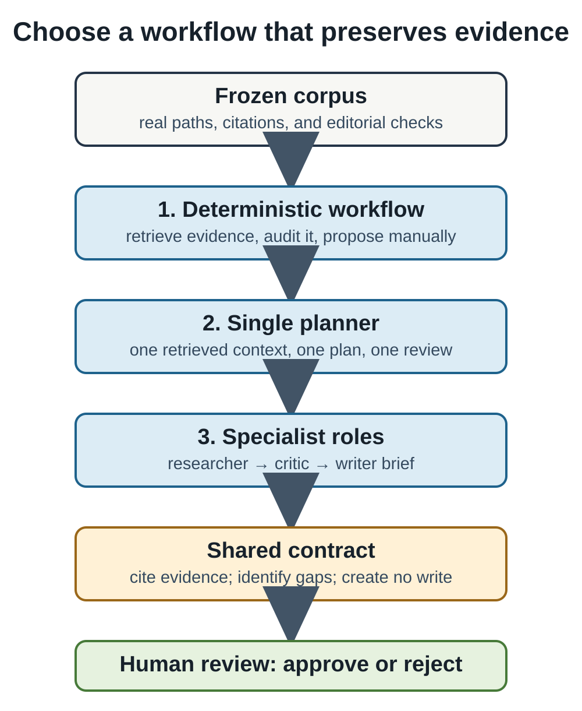

# When One Agent Is Not Enough

## Intuition

Multiple agents add specialization and review, but also coordination cost and
new failure modes. The useful question is not how many role labels a workflow
has; it is whether the added handoff catches a real risk.



The diagram is deliberately asymmetric. The three routes have different
internal steps, but they enter the same shared contract before the human sees a
proposal. A system does not become safer merely because it has a researcher, a
critic, and a writer in its prompt. It becomes safer only when each handoff has
a visible input, an inspectable output, and a testable boundary on what can
happen next.

## Problem

Compare three safe shapes on the same frozen book-maintenance task: deterministic
retrieval and review, one planner, and researcher/critic/writer roles. Every
shape must cite the same evidence, flag the same missing editorial section,
require human approval, and make no write.

This is a contract comparison, not a model leaderboard. The fixture asks a
concrete maintenance question: locate the explanation of cosine similarity and
review a deliberately incomplete Chapter 8 draft. The expected evidence path
and missing `Alternatives` section are versioned with the fixture. That lets
the comparison fail if a role loses provenance, skips the review, or acquires
write behavior, even when no remote model, API key, or nondeterministic output
is available.

## Minimal implementation

[workflow_comparison.py](../../src/from_tensors_to_agents/workflow_comparison.py)
keeps the roles deterministic so the comparison is repeatable without an API
key. The writer produces only a brief; it has no file or Git capability.

The control path calls the ordinary retrieval and corpus-review functions and
leaves interpretation to a human. It is the baseline for both complexity and
reliability: if it already finds the relevant path and editorial omission, a
more elaborate graph must demonstrate what it adds. The single-planner path
uses one retrieved context to make a short plan. The specialist path turns the
same work into explicit handoffs, making each role's responsibility visible in
the report rather than hiding it inside a long prompt.

```bash
uv run --group agents python experiments/13-workflows/compare_workflows.py
```

## Real implementation

The deterministic workflow is the control. The single planner combines
retrieval, planning, and review context. The role pipeline separates researcher,
critic, and writer responsibilities, then stops for approval. All three passed
the same path-attribution, review-coverage, approval-boundary, and no-write
checks in the frozen fixture. See `benchmarks/08-workflow-comparison/README.md`.

Each `WorkflowReport` carries the evidence paths, ordered plan steps, findings,
writer brief, approval requirement, and an explicit `writes_performed` flag.
Those fields are intentionally mundane. They give tests something more useful
than a persuasive paragraph to inspect. In particular, the researcher/critic/
writer variant cannot hide a write behind its writer label: the writer produces
a brief, and the report records that no write occurred.

An API-backed version may replace a deterministic role's text generation, but
it must preserve this envelope. The provider configuration belongs in process
environment variables, the retrieved paths must remain attached to every
proposal, and malformed structured output must fail closed. Until the project
records a controlled evaluation with a selected model, latency, cost, answer
quality, and failure recovery are unknown—not evidence for choosing one shape.

## Experiment

The recorded output shows all four contract checks as true. This does not show
that a multi-agent system is more accurate or useful: no remote model was run.
It establishes a baseline that an API-backed comparison must beat under a
declared quality, cost, and latency protocol.

Run the comparison, then inspect its compact table rather than treating a
passing exit code as the whole result. Every row should attribute
the fixture's expected research-note path, report the missing-alternatives finding,
require approval, and report no write. A failed cell identifies the broken
contract directly. The accompanying test repeats the same assertions in
`tests/test_workflow_comparison.py`, so a refactor cannot silently widen a
role's authority.

For a future controlled comparison, hold the corpus, objective, retrieval
count, model settings, and evaluator fixed. Pre-register a small scoring rubric
for citation accuracy, plan completeness, review usefulness, latency, and
unsafe-action refusal. Record failures as well as successful traces. Only then
ask whether an extra critic catches omissions that a single planner misses
often enough to justify its additional requests and coordination.

## What broke

Role separation can duplicate retrieval, lose context at a handoff, or make
responsibility less clear. A writer role is especially dangerous when it can
quietly turn a proposal into a mutation. This implementation avoids that risk
by making its output a read-only brief.

Another common failure is role theatre: several agents repeat the same search,
then agree with one another because they share the same incomplete context. A
critic is useful only if it receives an independently inspectable target—such
as the plan, cited paths, and editorial checklist—and can return a finding that
the workflow records. If a handoff has no distinct input or decision, remove
it. It adds latency and a new place for evidence to disappear without adding a
testable safeguard.

## Alternatives

Use one deterministic workflow for routine, inspectable checks. Use a single
planner when one coherent proposal is enough. Add specialist roles only when
their independently testable review adds value. A pull request or human editor
can be a better critic than another model.

A fixed rules engine is often the best first critic for manuscript work: it can
check headings, paths, citation keys, and missing required sections exactly.
Use a language model only for the residual work that needs interpretation, such
as suggesting an experiment or identifying a confusing explanation. This
division keeps objective checks reproducible and makes the model's uncertain
judgment explicit.

## When to use it—and when not to

Use multi-role workflow when research, criticism, and drafting have different
evidence needs and their handoffs are observable. Do not use it to manufacture
confidence, parallelize an already simple task, or evade approval.

Choose roles from the failure you need to reduce. If retrieval occasionally
loses citation keys, strengthen retrieval tests before adding a writer. If a
plan routinely omits alternatives, a deterministic editorial audit may be
cheaper than a critic model. If a high-stakes revision needs separate evidence
review and explanatory drafting, then a role boundary can make review easier.
In every case, a human remains responsible for deciding whether the proposed
change should become a repository change.

## Takeaway

More agents are justified only by measured, auditable improvement. Until then,
the smallest workflow that preserves evidence and human control is the best one.
