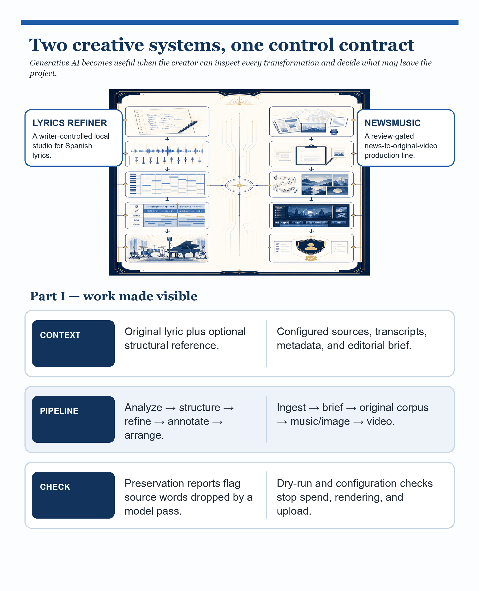
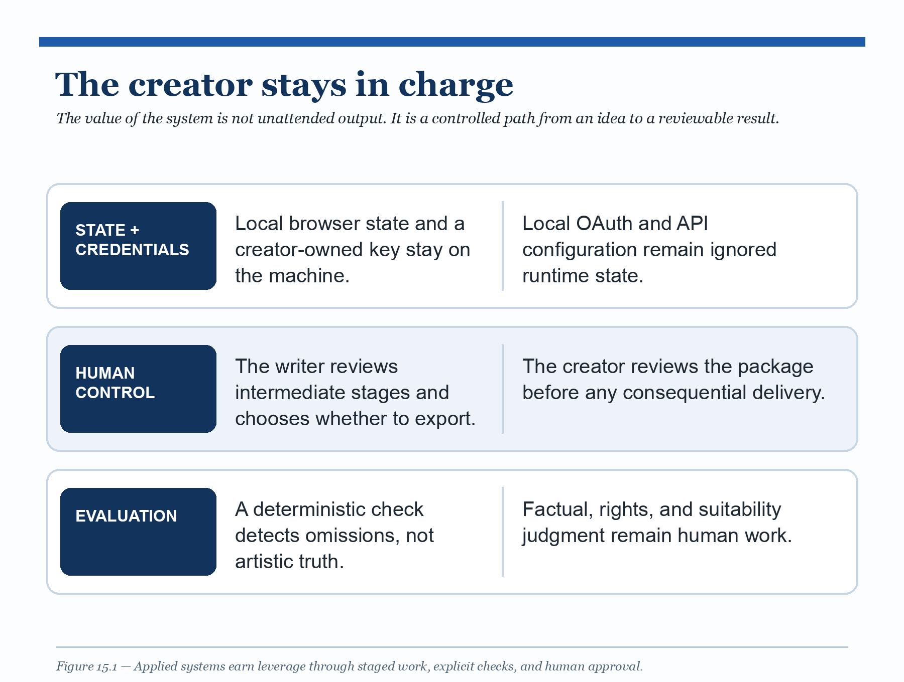

# Generative AI Lab

The earlier chapters built the pieces of an AI system: representations,
retrieval, structured outputs, state, evaluation, and human control. This final
lab asks a more practical question: what do those pieces look like when the
output is creative work that a person may publish?

The answer is not a universal "generate" button. It is a creative system that
turns a person’s raw material into more useful options without taking away the
person’s voice, accounts, or final judgment. The useful pattern is a clear
source boundary, narrow model responsibilities, inspectable intermediate work,
deterministic checks where they are possible, and a human decision before a
result leaves the project.

## Intuition

Generative systems become valuable when they compress the repetitive parts of a
real production process while keeping authorship visible. A lyric arrangement
can move from a raw draft to performance-ready directions without losing the
writer’s words. A news-inspired video can move from fresh reporting context to
an original media package without confusing source material with permission to
reuse it. In both cases, the creator remains the owner of the voice, accounts,
and final judgment.

This chapter studies two open-source projects maintained outside this book.
They are case studies, not dependencies of `mac-ai`: [Lyrics Refiner](https://github.com/hassanvfx/lyrics-refiner)
is a local arrangement workbench for Spanish-language lyrics, while
[Newsmusic](https://github.com/hassanvfx/newsmusic) is a staged pipeline from
news context to original, review-gated YouTube-ready media.

## Problem

A single prompt can hide too many decisions. "Turn these lyrics into a song"
can silently replace wording. "Turn this headline into a video" can blur the
boundary between context, generated media, rights, facts, credentials, and a
publish action. A plausible result is not evidence that the workflow respected
those boundaries.

The design problem is therefore broader than model quality: preserve the source,
make each meaningful transformation visible, measure a concrete invariant when
one exists, and require a person to approve the action that changes the outside
world.

## Minimal implementation

A minimal generative workflow can be expressed as a small contract:

```text
source → bounded model task → inspect result → deterministic check → human decision
```

The source stays identifiable. Each model task has one job. A program checks
what it can check without asking the model to grade itself. The final human
decides whether to retry, revise, export, or publish.

Run this chapter’s companion guide before cloning either external project:

```bash
uv run python experiments/15-generative-ai-lab/case_study_check.py
```

It prints the official project URLs, the safe-first commands, and the conditions
that must be true before a credential or publish action is considered.

## Real implementation: two different production boundaries

### Case study 1: Lyrics Refiner gives a writer a controllable studio

Lyrics Refiner is a local React creative studio for Spanish lyrics, including
Regional Mexican styles. A writer starts with the actual lyric—not a generic
prompt—and receives a structured path toward a performance-ready arrangement:
style and phonetic analysis, structure, optional reference-shape matching,
semantic repair, performance annotations, and ad-libs. The payoff is leverage
without a black box: the writer can tune the arrangement controls, open every
intermediate stage, and export only the version that still sounds like the
writer [@lyricsrefiner2026; @lyricsrefinerarticle2026].

Its most important deterministic boundary is word preservation. After a stage,
the system cleans tags and annotations, compares the candidate with the
original source, and reports missing words. The check cannot decide whether a
performance choice has taste or cultural authenticity. It does protect the
writer from a specific and common failure: a model pass quietly dropped source
words while making the output look polished.

The security boundary matters as much as the prompt design. The project is
local-only because its Vite client reads a user-owned OpenAI key. A browser build
containing that key must not be deployed or shared. A hosted version would need
a server-side API boundary instead.

Safe-first path:

```bash
git clone https://github.com/hassanvfx/lyrics-refiner.git
cd lyrics-refiner
npm install
cp .env.example .env
```

Read the project README before adding a key. Use only lyrics you are authorized
to share, keep `.env` local, and inspect every stage before exporting an
arrangement.

### Case study 2: Newsmusic turns a daily format into a controlled production line

Newsmusic is a creator-production system for turning news context into original,
YouTube-ready music-video packages. It begins with configured channel metadata
and transcripts, forms an editorial brief, develops an original song corpus and
creative direction, generates music and imagery, assembles a video, and
prepares delivery metadata. It is designed around a repeatable daily format:
find the story, make an original interpretation, assemble the video, and make
the package ready for the creator’s channel. Its active orchestrator keeps
third-party news-footage downloading disabled, while the default upload profile
is private and review-gated [@newsmusic2026; @newsmusicarticle2026].

That separation makes a powerful workflow stoppable. A creator can inspect the
brief, lyrics, media, and final package before any upload. Google OAuth and
generation credentials remain local, ignored by Git, and owned by the creator—
not by the repository or this book. The workflow automates a chain of work; it
does not automate editorial accountability.

Safe-first path:

```bash
git clone https://github.com/hassanvfx/newsmusic.git
cd newsmusic
python3 -m venv .venv
./.venv/bin/pip install -e '.[dev]'
git clone https://github.com/hassanvfx/kie-api-python vendor/kie-api-python
cp .env.example .env
./.venv/bin/python -m newsmusic.cli orchestrate --until video --dry-run
```

Leave the project in dry-run mode. Do not add credentials, spend generation
credits, or upload anything until you understand the relevant provider terms,
rights, factual-review, and channel policies.

## Experiment

Use the companion guide, then perform a paper-and-terminal audit rather than a
live generation:

1. For Lyrics Refiner, identify the original lyric, each staged artifact, and
   the word-preservation report. Explain one failure that the deterministic
   check catches and one judgment it cannot make.
2. For Newsmusic, trace a single story from source context through the private
   review boundary. List the points where a person can stop the run.
3. Compare the two workflows. Mark which controls protect source integrity,
   credentials, external actions, factual accuracy, and rights.
4. Record the repository revision and documentation URL you read. Do not treat
   a changing external repository as a permanent benchmark result.

\newpage



\newpage



## What broke

Both projects make the same general failure visible: an output can look finished
while violating a constraint that was never measured. A preserved-word score can
miss awkward phrasing, accidental similarity, or a poor performance choice.
Dry-run success can miss factual errors, rights restrictions, poor channel fit,
or an unsafe live credential configuration.

There are also project-specific traps. Lyrics Refiner must not be deployed with
a `VITE_*` key. Newsmusic must not turn reporting context into permission to
reuse third-party footage, and a private upload is still a consequential
external action. In both cases, generated material needs human review before
public use.

## Alternatives

For lyrics, a human arranger, editor, or producer can be the right tool when
the work requires cultural knowledge, performance judgment, or collaboration
that a preservation check cannot provide. For creator media, a conventional
editorial and production team can be preferable when rights clearance, fact
checking, and publishing scale exceed the value of automation.

At the other extreme, a one-shot prompt is useful for a throwaway sketch. It is
not a substitute for a production workflow when the source text, credentials,
or public distribution matter.

## When to use it—and when not to

Use a staged generative workflow when you can state what must remain true, make
intermediate work inspectable, and name the person who approves irreversible
actions. Prefer local and dry-run paths while you are learning the system.

Do not use either case study to process material you are not authorized to
share, to evade provider or platform rules, or to publish without factual,
rights, and suitability review. This chapter does not promise audience growth,
monetization, cultural authenticity, or legal clearance.

## Evidence trail

Read the project sources and the companion articles for implementation details:

- [Lyrics Refiner repository](https://github.com/hassanvfx/lyrics-refiner) and
  [engineering story](https://uriostegui.medium.com/turn-raw-lyrics-into-performance-ready-songs-92f62322ff9e?postPublishedType=initial).
- [Newsmusic repository](https://github.com/hassanvfx/newsmusic) and
  [project story](https://uriostegui.medium.com/75427bae1309).
- `experiments/15-generative-ai-lab/case_study_check.py` and
  `benchmarks/09-generative-ai-lab/README.md` for this book’s safe-first audit.
- `research/08-generative-ai-lab/notes.md` for source boundaries and
  non-claims.

## Takeaway

Generative AI becomes a useful production tool when it is placed inside a
workflow with visible transformations, narrow checks, local credential control,
and a person responsible for publication. The goal is not to remove the creator
from the loop; it is to give the creator more leverage without losing the
authority to say no.
